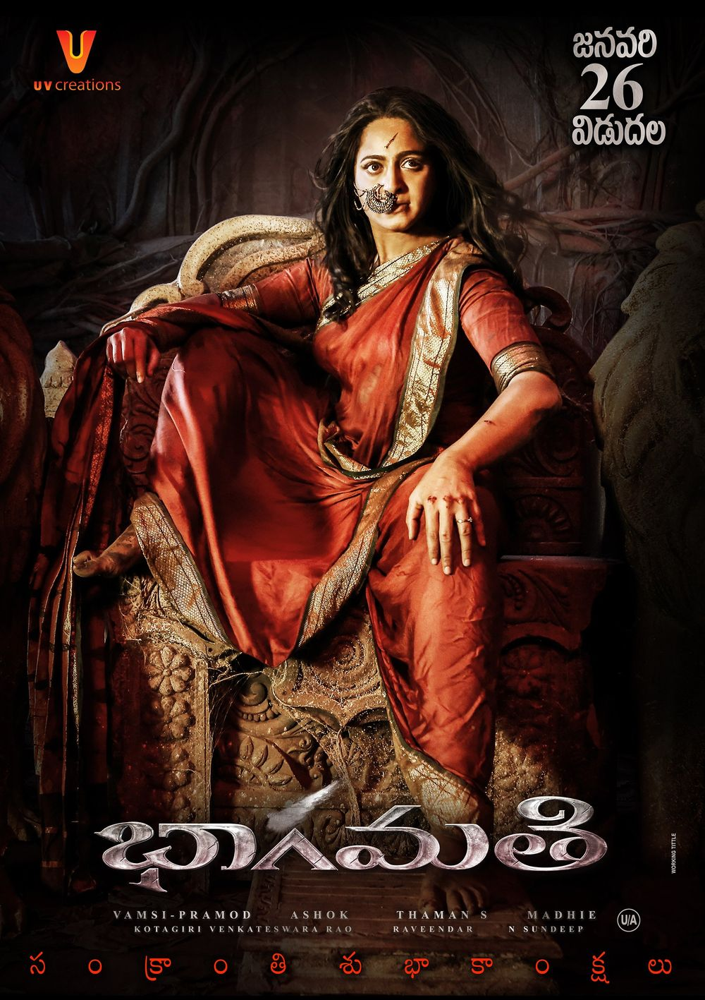

# Bhaagamathie

| |                             |
|--------------------|-----------------------------| 
| Release Date       | 26th January 2018           |
| Director           | G. Ashok                    |
| Genre              | Horror / Thriller / Crime   |
| Status             | Watched                     |
| Watch Start Date   | 19th February 2026          |
| Watch End Date     | 19th February 2026          |
| Runtime            | 2h 15m                      |
| Rating             | ★★★☆☆ (4.0/10)              |
| Platform           | Home                        |
| Language           | Telugu                      |
| Country            | India                       |
| Industry           | Tollywood                   |

## Overview

Bhaagamathie is a Telugu supernatural thriller centered on a former IAS officer who is taken to a haunted mansion for interrogation, only for strange and terrifying events to unfold around her.

## Story & Atmosphere

If you're going into Bhaagamathie expecting a genuinely scary horror experience, chances are you'll walk away feeling a little short-changed. For a film that's built around a haunted mansion and a possessing spirit, it surprisingly lacks the real scares and chilling moments you'd hope for. It plays it far too safe — leaning more into drama and political thriller territory rather than committing fully to its horror roots. The atmosphere tries hard, but the actual horror elements feel surface-level and toothless, rarely delivering the kind of tension or dread that a good horror film should.

The supernatural elements, while visually interesting at times, never truly feel threatening or unsettling enough to leave a lasting impression. The haunted mansion setting had so much potential that largely goes to waste.

## Performances & Direction

Anushka Shetty delivers a commendable performance, anchoring the film with her commanding presence. She navigates the complex demands of the role well, particularly in the scenes requiring intensity and authority. However, even her strong performance cannot fully save a film that feels confused about its identity, wavering between a political thriller and a supernatural horror without fully committing to either. The direction plays it too safe, missing opportunities to build genuine dread.

## Folklore & Mythology

### The Legend of Queen Bhaagamathie
At the heart of the movie lies a rich and haunting piece of folklore centered around the legendary queen Bhaagamathie. While the film presents a fictionalized version, the folklore woven into the story draws heavily from the cultural traditions and mythological storytelling of South India.

**Who Was Bhaagamathie?**
According to the folklore presented in the film, Bhaagamathie was a powerful and fiercely just queen who ruled her kingdom with an iron fist and an unshakeable moral compass. She was known for being a protector of the innocent and a punisher of the corrupt and the wicked. She was not just a ruler — she was seen as a divine force, almost godlike in her power and judgment.

**The Curse and the Haunting**
The legend goes that Bhaagamathie was betrayed, wronged, and met a tragic end under deeply unjust circumstances. Rather than passing on peacefully, her spirit remained bound to the mansion — refusing to rest until justice was fully served. Her spirit is depicted as neither purely evil nor purely benevolent. She is a force of cosmic justice — she won't harm the innocent but will absolutely unleash her fury on those who are corrupt, deceitful, or cruel.

**The Haunted Mansion**
The mansion itself is deeply tied to the folklore. Locals in the film believe that the mansion is cursed ground — a place where Bhaagamathie's spirit roams freely and guards jealously. Anyone who enters with ill intent is said to face her wrath. Over the years, mysterious incidents and disappearances around the mansion have only strengthened the legend in the minds of the people living nearby, making it a place that is feared and avoided at all costs.

**Possession as a Folklore Element**
The concept of spirit possession used in the film is deeply rooted in South Indian folk tradition. In many rural communities across Andhra Pradesh and Telangana, there are long-standing beliefs in powerful female spirits — often called Ammavaru or mother goddesses — who are said to possess individuals to communicate, seek justice, or protect their devotees. Bhaagamathie fits neatly into this tradition of the wronged, powerful feminine spirit who returns to set things right.

**Justice Beyond Death**
Perhaps the most compelling piece of folklore the film taps into is the idea that powerful souls don't simply disappear after death — especially if they were wronged. This belief, common across many Indian folk traditions, holds that a spirit with unfinished business will remain in the mortal world, sometimes protecting, sometimes haunting, until justice is finally delivered. Bhaagamathie embodies this idea perfectly — she is patient, she is watchful, and when the time comes, she is absolutely merciless toward the guilty.

**In a Nutshell**
The folklore of Bhaagamathie blends the archetype of the wronged queen, the tradition of divine feminine spirits in South Indian culture, and the timeless human belief that justice — one way or another — will always find its way. It's this rich folkloric foundation that gives the film much of its soul and makes Bhaagamathie feel like more than just a ghost story — she feels like a myth, a legend, and a force of nature all rolled into one.

## Verdict

Overall, Bhaagamathie is a decent one-time watch at best — a film that had all the right ingredients for a gripping horror thriller but failed to cook them properly. It's neither scary enough to satisfy horror fans nor thrilling enough to fully satisfy thriller fans either.

My overall rating is 2/5 (★★☆☆☆).

---

### Rating Breakdown

| Category | Score | Notes |
|---|---|---|
| **Cinematography** | **6/10** | Visually interesting at times, atmosphere tries hard. |
| **Plot** | **4/10** | Plays it too safe, confused about its identity. |
| **Story** | **4/10** | Wasted potential of the haunted mansion setting. |
| **Character Development** | **4/10** | Commendable performance by Anushka Shetty, but characters feel surface-level. |
| **Scares/Horror** | **2/10** | Toothless, lacks tension or dread. |
| **Enjoyment** | **4/10** | Decent one-time watch, felt short-changed. |
| **Overall** | **4/10** | Neither scary enough nor thrilling enough. |
| **Pace** | **4/10** | Lacks the tension a good horror film should have. |

---

## Personal Notes & Observations

- Watching in Telugu
- Started: 19th February 2026

### Viewing Progress

**At start (19th February 2026):**
- Completed on 19th February 2026.

---

## Rewatch Value

**Low.**

Bhaagamathie is a decent one-time watch, primarily for Anushka Shetty's performance and the production values. However, the lack of genuine scares and the reliance on a specific narrative structure limit its replay value. Once the mystery is known, there is little in the way of atmosphere or deeper nuance to warrant a revisit.

**Similar films:**
- [Virupaksha](virupaksha.md) (Telugu horror with similar themes)
- **Arundhati** (The benchmark for this genre)

---
