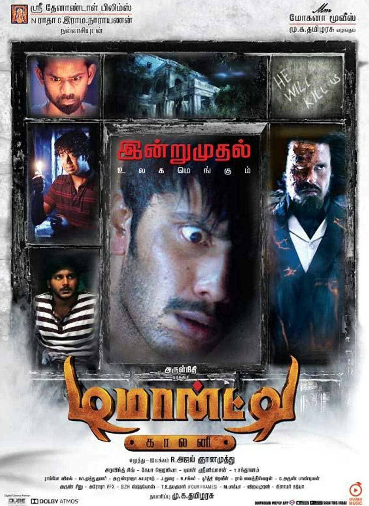

# Demonte Colony

| |                             |
|--------------------|-----------------------------| 
| Release Date       | 22nd May 2015               |
| Director           | R. Ajay Gnanamuthu          |
| Genre              | Horror / Thriller           |
| Status             | Watching                    |
| Watch Start Date   | 20th February 2026          |
| Watch End Date     | TBD                         |
| Runtime            | 1h 56m                      |
| Rating             | TBD                         |
| Platform           | Home                        |
| Language           | Hindi (Dubbed from Tamil)   |
| Country            | India                       |
| Industry           | Kollywood                   |

## Overview

Four friends completely drunk, decide to do something adventurous and visit a haunted mansion. They return home without realizing that they have brought a cursed spirit with them.

## Story & Atmosphere

[Detailed thoughts on the story, narrative structure, atmosphere, setting, and how the film builds its world and tension]

## Performances & Direction

[Analysis of the director's work, acting performances, cinematography, sound design, and technical aspects]

## Themes & Impact

[Discussion of themes, deeper meanings, social commentary, and the film's impact]

## Verdict

**Rating: TBD**

[Final thoughts and overall assessment]

---

### Rating Breakdown

| Category | Score | Notes |
|---|---|---|
| **Cinematography** | **TBD** | [Brief note on visual quality, camera work, production values] |
| **Plot** | **TBD** | [Brief note on the core concept and premise] |
| **Story** | **TBD** | [Brief note on execution and narrative] |
| **Character Development** | **TBD** | [Brief note on characters and performances] |
| **Scares/Horror** | **TBD** | [For horror films - effectiveness of scares/tension] |
| **Enjoyment** | **TBD** | [Overall entertainment value] |
| **Overall** | **TBD** | **[Classification]** ([brief summary]) |
| **Pace** | **[Descriptor]** | [Brief note on pacing] |

---

## Personal Notes & Observations

*(Raw thoughts, memorable quotes, scenes that stood out, or any additional context)*

- Watched in Hindi (dubbed from Tamil)
- Started watching: 20th February 2026

### Memorable Moments

- TBD

---

## Rewatch Value

**Would I watch again?** TBD

**Best watched:** [Recommended viewing context]

**Similar films:** 
- TBD

---
