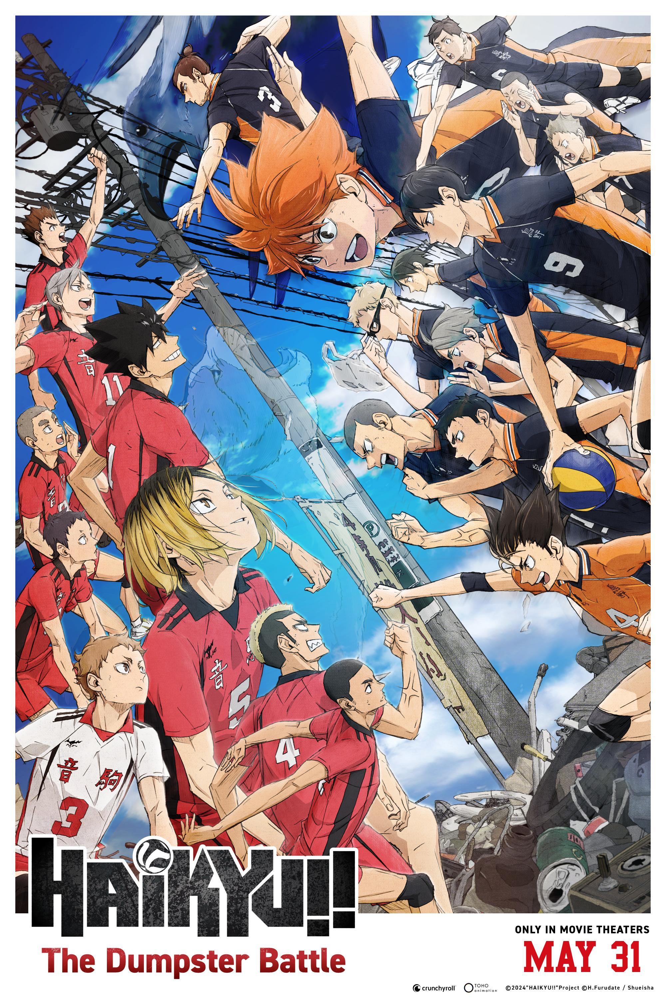

# Haikyu!! The Dumpster Battle

| |                             |
|--------------------|-----------------------------| 
| Release Date       | 16th February 2024          |
| Director           | Susumu Mitsunaka            |
| Genre              | Animation / Sports          |
| Status             | Watched                     |
| Watch Start Date   | 22nd March 2026             |
| Watch End Date     | 22nd March 2026             |
| Runtime            | 1h 25m                      |
| Rating             | ★★★⯪☆ (7.5/10)               |
| Platform           | Home                        |
| Language           | English                     |
| Country            | Japan                       |
| Industry           | Anime                       |

## Overview

The highly anticipated showdown between Karasuno High School and their fateful rivals, Nekoma High School. Known as the "Dumpster Battle," this Nationals match forces the offensive powerhouse of Karasuno to clash directly with the ultimate defensive floor-defense of Nekoma in a game where there are no "do-overs."

## Story & Atmosphere

If you've been following Karasuno's journey from the beginning, this movie is the ultimate payoff. The tension is palpable, and the atmosphere in the arena feels electric. However, because it condenses what should arguably be a full season of television into an 85-minute film, the pacing is absolutely relentless. You barely get a moment to breathe. While this perfectly mirrors the exhausting, non-stop nature of a real volleyball match, it does mean we lose some of the quieter character moments and inner monologues that made the series so rich. 

## Performances & Direction

Production I.G completely outdid themselves here. The animation is kinetic, heavy, and visceral—you can feel the impact of every spike and the desperation of every dive. Susumu Mitsunaka's direction shines brightest during the final rallies, utilizing breathtaking first-person perspective tracking shots that put you directly into the shoes of the exhausted players (specifically Kenma). The sound design, from the squeaking of shoes to the heavy breathing, elevates the tension to the absolute maximum.

## Themes & Impact

At its core, this match is about two completely different philosophies of play and life. Hinata's boundless, soaring energy versus Kenma's calculated, video-game-like approach. The most impactful part of the "Dumpster Battle" isn't just about who wins or loses; it's about seeing Kenma, a character who notoriously views volleyball as just a game to pass the time, finally exert himself and admit that it's *fun*. It's a beautiful, character-defining realization that serves as the emotional anchor of the film.

## Verdict

**Rating: ★★★⯪☆ (7.5/10)**

An incredibly hype, beautifully animated conclusion to one of the most iconic rivalries in sports anime. While the brisk runtime forces the story to rush past some nuances present in the manga, the sheer spectacle, emotional weight, and staggering animation quality make it a must-watch for any *Haikyu!!* fan. It’s sweaty, exhausting, and undeniably exhilarating.

---

### Rating Breakdown

| Category | Score | Notes |
|---|---|---|
| **Animation/Visuals** | **9.0/10** | Incredible dynamic camera angles, visceral impacts, and a legendary POV sequence. |
| **Plot** | **7.0/10** | Very straightforward—it's a volleyball match from start to finish. |
| **Story** | **7.5/10** | Great emotional payoffs, though severely condensed from the source material. |
| **Character Development** | **8.0/10** | Kenma is the undisputed star here; his arc reaches a fantastic peak. |
| **Enjoyment** | **8.5/10** | Pure, unfiltered hype for 85 minutes straight. |
| **Overall** | **7.5/10** | **Great** (A breathtaking but rushed spectacle for the fans.) |
| **Pace** | **Relentless** | Matches the frantic energy of the sport, leaving little room to breathe. |

---

## Personal Notes & Observations

*(Raw thoughts, memorable quotes, scenes that stood out, or any additional context)*

- That final POV shot from Kenma’s perspective was one of the most stressful and breathtaking things I’ve seen in sports anime.
- I really missed some of the slower, reflective moments that the TV show had. The movie felt like it was playing on 1.5x speed sometimes.
- Kuroo and Kenma's childhood flashbacks hit incredibly hard.
- "This is fun." — Just hearing Kenma say that made the entire journey worth it.

### Memorable Moments

- Kenma's first-person POV in the final rally.
- The sheer terror of Karasuno realizing they are being steadily suffocated by Nekoma's strategy.
- The final point of the match and the immediate aftermath.

---

## Rewatch Value

**Would I watch again?** Definitely! 🔥

**Best watched:** When you need a quick shot of adrenaline or want to feel incredibly motivated.

**Similar films:** 
- The First Slam Dunk
- Kuroko's Basketball The Movie: Last Game
- Blue Lock: Episode Nagi

---

## Additional Context

This film adapts chapters 293 to 325 of Haruichi Furudate's original manga. Given the density of the source material being covered in roughly an hour and a half, the film operates at an incredibly fast pace compared to the earlier TV seasons, trimming down significantly on inner monologues and side-character reactions. 

---
