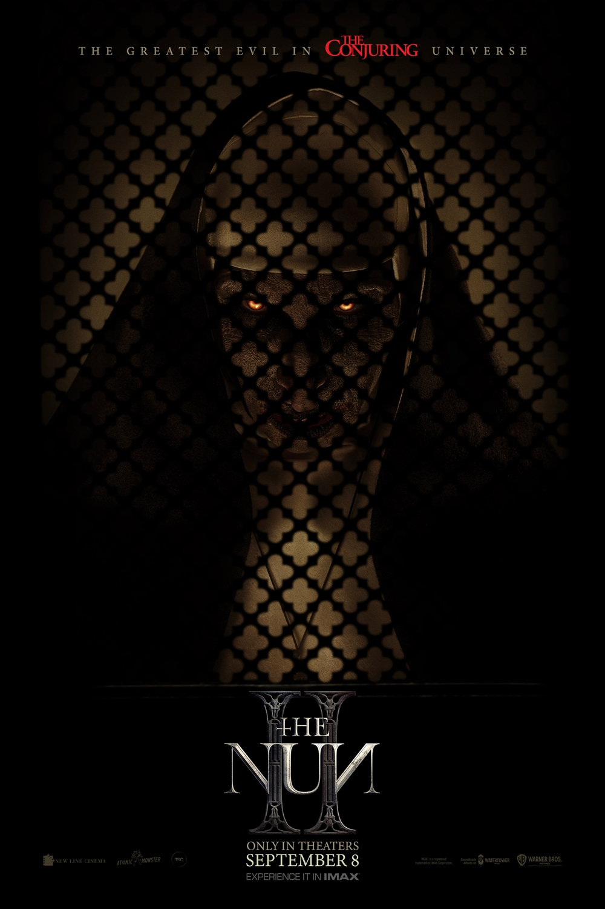

# The Nun II

| |                             |
|--------------------|-----------------------------| 
| Release Date       | 8 September 2023            |
| Director           | Michael Chaves              |
| Genre              | Horror / Supernatural       |
| Status             | Watched                     |
| Watch Start Date   | Past Viewing                |
| Watch End Date     | Past Viewing                |
| Runtime            | 1h 50m                      |
| Rating             | ★★★☆☆ (6/10)                |
| Platform           | Home                        |
| Language           | English                     |
| Country            | USA                         |
| Industry           | Hollywood                   |

## Overview

**The Nun II** picks up four years after the events of the first film. Sister Irene is living in anonymity in a convent in Italy, but Valak has returned, cutting a bloody path across Europe in search of a holy relic. Irene must once again confront the demon face-to-face to save her friend Maurice.

## Story & Atmosphere

This sequel is a significant improvement over the first *Nun* film. The setting—a boarding school in France—provides plenty of spooky corridors and hidden rooms. The story is more coherent, focusing on a mystery involving the eyes of Saint Lucy.

Director Michael Chaves brings a sharper visual style here than he did in *The Conjuring 3*. The scares are more creative (the magazine stand scene is a standout visual). However, the third act descends into a CGI-heavy battle that feels more like a superhero movie than a horror film.

## Performances & Direction

**Taissa Farmiga** continues to be a compelling lead, bringing a quiet strength to Sister Irene. **Storm Reid** joins the cast as a skeptical nun, providing a good foil to Irene's faith.

**Bonnie Aarons** is underused as the Nun herself; the entity spends a lot of time shape-shifting or hiding in shadows.

**Michael Chaves** crafts some excellent scare sequences. The "Magazines" silhouette and the "Goat Demon" are visually memorable, even if the tension doesn't always land.

## Folklore & Mythology

### Saint Lucy (Santa Lucia)
The film revolves around the relic of Saint Lucy, a Christian martyr who died during the Diocletianic Persecution. Tradition says her eyes were gouged out prior to her execution. She is the patron saint of the blind. The film turns her eyes into a MacGuffin that grants immense power (even to angels/demons), which is a bit of a stretch but fits the Indiana Jones-esque tone.

### Pagan Roots
The film introduces a "Goat Demon" (likely Baphomet imagery), hinting at the pagan origins of the evils Valak commands. It touches on the idea that these locations have layers of history—a winery, a chapel, a pagan site.

### The Frenchie Tragedy
The film deepens the tragedy of Maurice (Frenchie). We know from the first *Conjuring* film that his story ends badly (he tries to kill his father and is eventually exorcised by the Warrens, an event which deeply affects Lorraine). Watching him struggle here knowing his eventual fate adds a layer of sadness.

## Verdict

**The Nun II** is a decent horror sequel that fixes many (but not all) of the first film's problems. It has great set pieces and a solid mystery, but it strains under the weight of its own lore and CGI finale. It’s fun, spooky, and forgettable.

**Rating: ★★★☆☆ (6/10)**

---

### Rating Breakdown

| Category | Score | Notes |
|---|---|---|
| **Cinematography** | **7.5/10** | Visually distinct and atmospheric. |
| **Plot** | **6/10** | Relic hunt structure works well enough. |
| **Story** | **6/10** | Bridges the gap between Nun and Conjuring well. |
| **Character Development** | **6/10** | Irene gets stronger; Maurice gets tragic. |
| **Scares/Horror** | **6.5/10** | Some very creative visual scares. |
| **Enjoyment** | **6.5/10** | Better paced than the first one. |
| **Overall** | **6/10** | **Decent**. |
| **Pace** | **7/10** | Keeps moving. |

---

## Personal Notes & Observations

-   **The Magazine Stand**: Easily the best visual effect in the movie. It felt fresh.
-   **Mid-Credits Scene**: The tease of the Warrens (Ed responding to a call) brings us full circle.

### Viewing Progress

**Completed (Past Viewing):**
-   A solid entry that doesn't reinvent the wheel but keeps the franchise alive.
-   Firmly establishes the timeline leading into The Conjuring.

---

## Rewatch Value

**Moderate.**
Watchable for the set pieces.

**Similar films:**
-   [The Devil's Backbone](https://www.imdb.com/title/tt0256009/) (2001) - *School setting ghost story (Masterpiece).*
-   [Crimson Rivers II](https://www.imdb.com/title/tt0337103/) (2004) - *Religious monks and supernatural mystery.*
-   [Prey for the Devil](https://www.imdb.com/title/tt9271672/) (2022) - *More nun exorcism action.*
